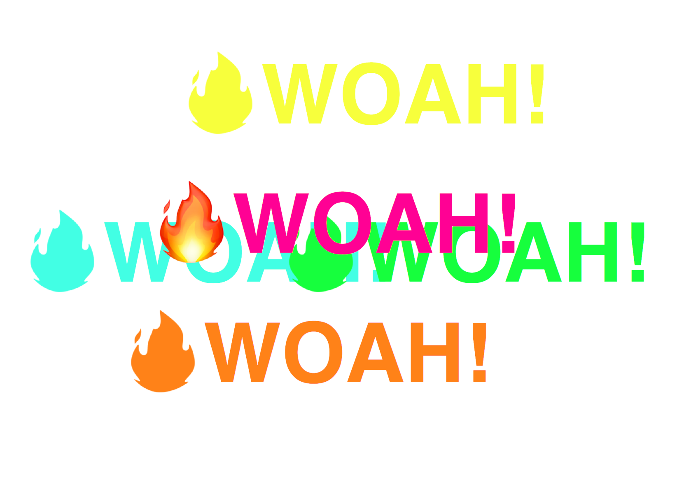

# Mouse Move Shadow

This project follows the [JavaScript30](https://javascript30.com/) tutorial. This project shows how to create a text shadow that moves in a direction related to the cursor movement within the window. On a phone or tablet, the shadow will move as the item is tipped in different directions.  

